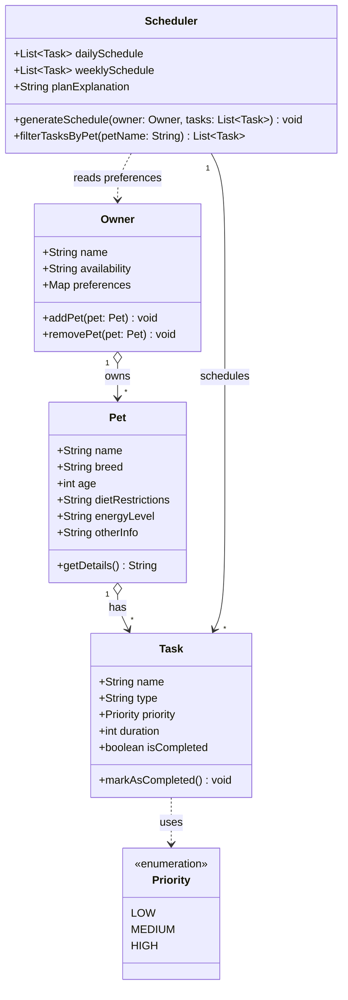

# Pet Care App Class Diagram

This diagram visualizes the simplified object-oriented design for the PawPal+ app based on the attributes and actions brainstormed in [class_architecture.md](file:///Users/rikaraxkz/Desktop/CodePath/AI110/AI110%20-%20PawPal+/class_architecture.md).

## Relationship Simplification & Design Cleanliness

To keep the model clean and avoid unnecessary coupling, the following changes were made:
- **Owner ➔ Pet (1-to-many Aggregation `o-->`):** An `Owner` has a collection of `Pet`s.
- **Pet ➔ Task (1-to-many Aggregation `o-->`):** A `Pet` has its own list of `Task`s. This directly supports the core user action of filtering daily or weekly tasks by pet name.
- **Scheduler Dependency (`..>`):** The `Scheduler` does not need to own or manage the `Owner`. Instead, it reads the `Owner`'s preferences and availability to generate/sort `Task`s.
- **Removed Helper Classes:** Removed the `Priority` enum class block to avoid visual clutter; `priority` in `Task` is now modeled as a standard `String` or simple attribute.

